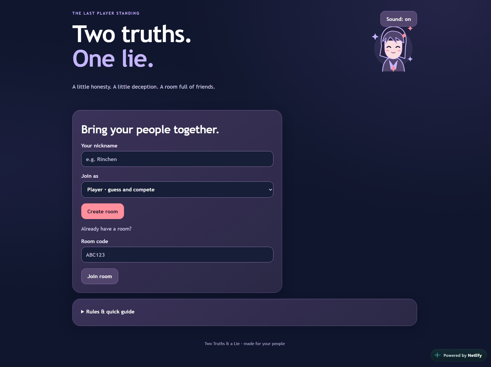

# Two Truths & One Lie

A multiplayer party game with an anime-inspired design, mobile-friendly screens, private room codes, and live scoring.

## AI disclosure

I used ChatGPT/Codex to generate all of this project's code, visual design, tests, and documentation. I provided the game idea, requirements, and feedback and used AI to implement and revise them. This is an AI-generated project, and I do not claim to have written the implementation independently.

## Front-page preview

## Features

- Rooms for 2–8 players, with up to 2 viewers
- Two truths and a lie, shuffled separately for each player
- Timed guesses, skips, elimination, and winner reveal
- Round rankings with response-speed tie breakers
- Netlify Functions and persistent Netlify Blobs storage

## Technology

HTML, CSS, JavaScript, TypeScript, Netlify Functions, and Netlify Blobs.

## Project and deployment details

# Two Truths & a Lie — Netlify conversion

The current design and game engine are preserved. The only frontend behavior change is its backend URL: `/.netlify/functions/game`.

## Deployment limitation — read first

This is a complete, tested Netlify Functions + Blobs project, with prebuilt frontend files and a packaged function. **It is not possible to deploy this multiplayer backend using Netlify Drop alone.** Netlify's drag-and-drop deploy publishes static files and does not run the build or deploy Functions. Uploading this entire ZIP to that dropzone will not make multiplayer work. Prebuilding the function does not change this limitation.

A supported Netlify Functions deployment (Netlify build, CLI, or API) must register the function. This archive does not ask you for GitHub, Terminal commands, API keys, environment variables, or database setup, and does not pretend the drag-and-drop limitation is solved. If your Netlify account offers an agent-driven deployment, ask it to deploy this project with its existing account authorization using `netlify.toml`.

Once deployed through a supported workflow, Blobs is automatically connected by Netlify. No custom secrets or manual database provisioning are required. There is no continuously running application server.

## Files

- `netlify.toml`: root build, publish, and function configuration; no redirects
- `netlify/functions/game.ts`: the only function entrypoint, default Netlify endpoint
- `lib/game.mjs`: unchanged game engine
- `lib/netlify-handler.mjs`: stateless request handling and optimistic concurrency
- `frontend/`: full current design and browser source
- `dist/`: prebuilt frontend
- `function-artifacts/game.zip`: Netlify-packaged function and bundled dependencies
- `package.json` and `package-lock.json`: pinned reproducible dependencies
- `tests/` and `scripts/`: reproducible build and verification

## Storage and timing

The site-scoped room store uses strong consistency. Room creation uses `onlyIfNew`; changes use the ETag from `getWithMetadata` with `onlyIfMatch`. Conflicts re-read and re-apply the action with bounded retries. Private statements and session secrets are filtered by the unchanged engine before responses.

Frontend polling advances stored deadlines; there are no backend interval timers. If everyone disconnects, the next request catches up the current phase. Rooms are stored across function invocations and deployments rather than in instance memory.

## Verification

See `VERIFICATION.md` for the exact test results and limits. Production bundling can be verified without a Netlify account. Tests simulate the Blobs HTTP service, including strong-read and conditional-write semantics; they are not claims of a live Netlify deployment.

Official references:
https://docs.netlify.com/deploy/create-deploys/
https://docs.netlify.com/build/functions/get-started/
https://docs.netlify.com/build/data-and-storage/netlify-blobs/
